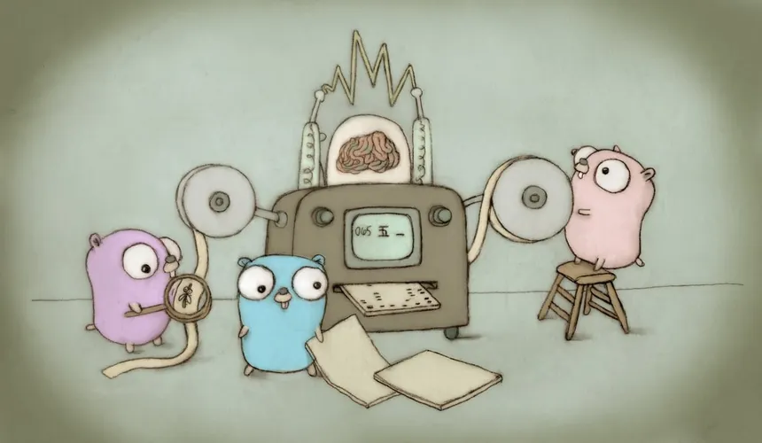

# Todo CLI 📝



This is a lightweight, terminal-based task management application built with **[Go](https://go.dev/#)**. It allows you to **add**, **update**, **delete**, and **list** tasks using simple commands. The tasks are written into and read from a **JSON** file for persistence.

> #### This is a sample solution for the [task-tracker](https://roadmap.sh/projects/task-tracker) project from **[roadmap.sh](https://roadmap.sh/)** projects.


## Features
- Add tasks with descriptions. 📝
- Update tasks by their ID. ✍️
- Delete tasks by their ID. 🗑️
- Mark tasks as in-progress or done. ☑️
- List tasks, optionally filtered by **status** (todo, in-progress, done). 📃
- Tasks are stored in a `tasks.json` file in the current directory. 📁


## Installation

### 1. Clone the Repository

```bash
git clone https://github.com/nirmit27/todo-cli.git
cd todo-cli
```

### 2. Build the Executable
Run the following command to build the executable:
```bash
go build -o todo-cli
```
This will create an executable file named `todo-cli` in the current directory.


## Usage
The task-cli application supports the following commands:

### 1. Add a Task
Add a new task with a **description**.

```bash
./todo-cli add "<description>"
```

#### Output:
```bash
Task added successfully! ID : n
```

### 2. Update a Task
Update the **description** of an existing task by its **ID**.

```bash
./todo-cli update <id> "<new description>"
```

#### Output:
```bash
Task [n] updated successfully!
```

### 3. Delete a Task
Delete a task by its **ID**.

```bash
./todo-cli delete <id>
```
#### Output:
```bash
Task [n] deleted successfully!
```

### 4. Mark a Task as _todo_, _in-progress_ or _done_
Update the status of a task by its **ID**.

```bash
./todo-cli mark <id> <new-status>
```

### 5. View Task details
Get the detailed view of a task by its **ID**.

```bash
./todo-cli details <id>
```

#### Output:
```bash
 --- Task [<id>] ---

 Description : <description>
 Status : <status>
 Created at : <time-of-creation>
 Updated at : <time-of-updation>
```

### 6. List All Tasks
List **all** the tasks stored in the JSON file.

```bash
./todo-cli list
```

### 7. List Tasks by Status
List tasks filtered by their status (`todo`, `in-progress`, or `done`).

```bash
./todo-cli list <status>
```


## Dependencies
This application is built using only Go's **standard library**. No external libraries are required.


## License
This project is licensed under the **MIT License**. See the [LICENSE](./LICENSE) file for more details.
